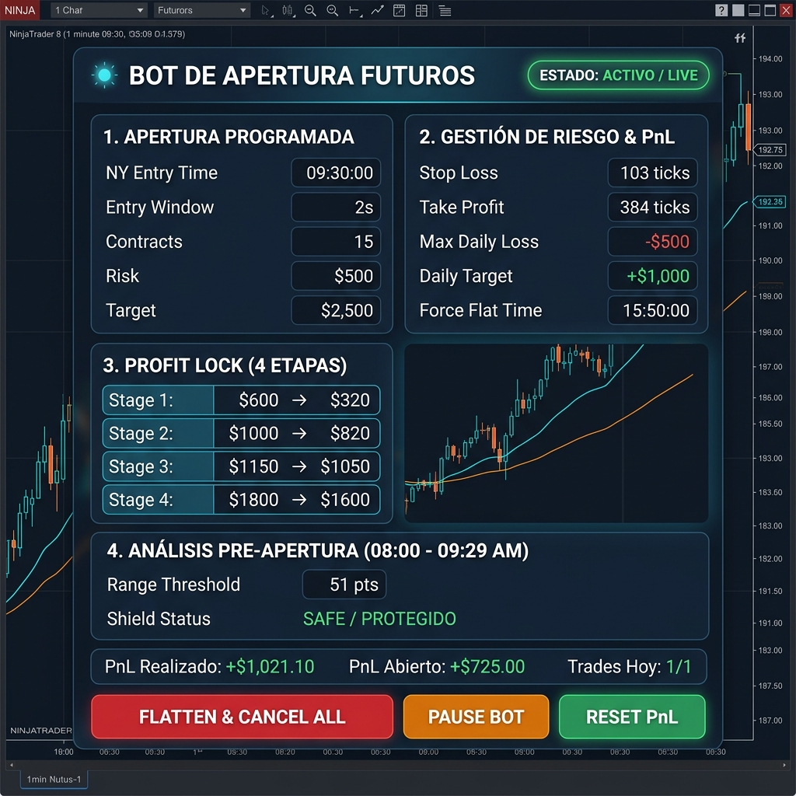
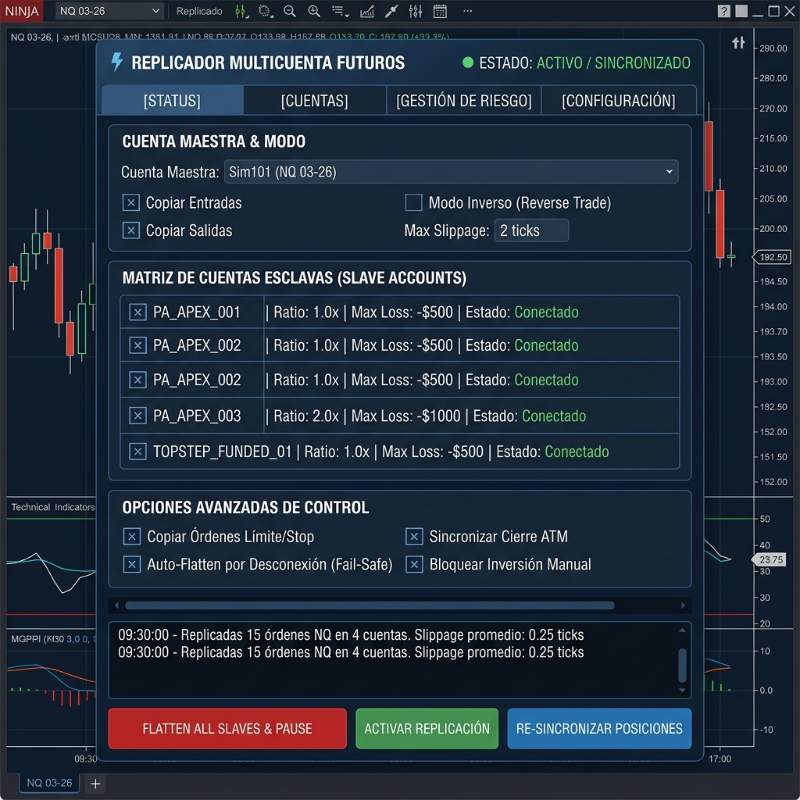

# MANUAL OPERATIVO TÉCNICO Y GUÍA EXPLICATIVA COMPLETA
## BotAperturaMercado & ReplicadorMulticuentaFuturos

---

## 🧠 1. AUTO-DETECCIÓN INTELIGENTE DE CUENTAS Y SALDOS

**Configuración 100% Automática y Sin Intervención Manual:**

* **Bot de Apertura (`BotAperturaMercado`):** Al iniciar, evalúa el saldo en USD (`CashValue`) y el nombre de la cuenta activa.
  - Si la cuenta es de **~$50K** asigna **2 contratos NQ** (-$500 Max Loss).
  - Si la cuenta es de **~$100K** asigna **5 contratos NQ** (-$1,000 Max Loss).
  - Si la cuenta es de **~$150K** asigna **15 contratos NQ** (-$1,500 Max Loss).
* **Replicador (`ReplicadorMulticuentaFuturos`):** Con el parámetro `SlaveAccountNames = AUTO`, el replicador detecta automáticamente todas las cuentas conectadas en NinjaTrader 8 (Apex, Topstep, etc.) y las sincroniza en tiempo real.

---

## 🤖 2. BOT DE APERTURA DE MERCADO (`BotAperturaMercado.cs`)

### 📋 Desglose Detallado por Secciones y Campos

| Sección | Elemento / Campo | Explicación Técnica y Función Práctica |
| :--- | :--- | :--- |
| **Encabezado** | `BOT DE APERTURA FUTUROS` | Nombre neutro del bot para operar contratos de futuros NQ/MNQ. |
| **Encabezado** | `ESTADO: ACTIVO / LIVE` | Muestra **ACTIVO (Verde)** en sesión o **BLOQUEADO POR PROTECCIÓN (Naranja)** fuera de 09:30-15:50 EST. |
| **1. Apertura Programada** | `NY Entry Time (09:30:00)` | Hora exacta fija del servidor para la entrada automática en la apertura de Nueva York. |
| **1. Apertura Programada** | `Entry Window (2s)` | Tolerancia de 2 segundos. Cancela la orden si sufre deslizamiento o retraso superior a 2s. |
| **1. Apertura Programada** | `Contracts` | Lotes asignados automáticamente según el saldo detectado (2 NQ para 50K, 15 NQ para 150K). |
| **1. Apertura Programada** | `Risk / Target ($500 / $2,500)` | Mapeo monetario del riesgo inicial y el objetivo de ganancia proyectado del trade. |
| **2. Gestión de Riesgo** | `Stop Loss (103 ticks)` | Distancia fija de protección de la orden Stop Loss inicial desde la entrada. |
| **2. Gestión de Riesgo** | `Take Profit (384 ticks)` | Distancia fija de la orden Take Profit objetivo desde la entrada. |
| **2. Gestión de Riesgo** | `Max Daily Loss (-$500)` | **Freno Diario de Pérdida**: Si el acumulado llega a -$500, liquida posiciones y bloquea el bot hoy. |
| **2. Gestión de Riesgo** | `Daily Target (+$1,000)` | **Freno Diario de Ganancia**: Al alcanzar la meta diaria, apaga el robot para conservar las ganancias. |
| **2. Gestión de Riesgo** | `Force Flat Time (15:50:00)` | Cierre forzado pre-cierre. Liquida cualquier posición abierta a las 3:50 PM EST. |
| **3. Profit Lock (4 Etapas)** | `Stage 1 ($600 ➔ $320)` | Al ganar $600 ➔ El Trailing Stop sube automáticamente y asegura $320 de beneficio. |
| **3. Profit Lock (4 Etapas)** | `Stage 2 ($1,000 ➔ $820)` | Al llegar a $1,000 ➔ Trailing Stop asegura $820. |
| **3. Profit Lock (4 Etapas)** | `Stage 3 ($1,150 ➔ $1,050)` | Al llegar a $1,150 ➔ Trailing Stop asegura $1,050. |
| **3. Profit Lock (4 Etapas)** | `Stage 4 ($1,800 ➔ $1,600)` | Al llegar a $1,800 ➔ Trailing Stop asegura $1,600 finales. |
| **4. Análisis Pre-Apertura** | `Range Threshold (51 pts)` | Mide el rango entre 08:00 y 09:29 AM. Si supera 51 pts, activa el escudo de protección. |
| **4. Análisis Pre-Apertura** | `Shield Status (SAFE)` | Muestra **SAFE (Verde)** si el pre-mercado está estable o **ABORT (Rojo)** si la volatilidad es peligrosa. |

### 🔘 Explicación Botón por Botón (Estrategia)

* 🚨 **`FLATTEN & CANCEL ALL`** *(Botón Rojo de Pánico)*: Cierra inmediatamente cualquier posición abierta al precio actual y cancela órdenes pendientes (SL/TP).
* ⏸️ **`PAUSE BOT`** *(Botón Naranja de Control)*: Pausa la búsqueda de nuevas entradas sin cerrar la operación que ya esté activa.
* 🟢 **`RESET PnL`** *(Botón Verde de Reinicio)*: Reinicia a $0 el contador diario de pérdidas y ganancias para permitir volver a operar si tocó el límite.

---

## 🔄 3. REPLICADOR MULTICUENTA DE FUTUROS (`ReplicadorMulticuentaFuturos.cs`)

### 📋 Desglose Detallado por Secciones y Campos

| Sección | Elemento / Campo | Explicación Técnica y Función Práctica |
| :--- | :--- | :--- |
| **Navegación** | `[STATUS] [CUENTAS] [RIESGO]` | Pestañas superiores para alternar entre estado de conexión, matriz de cuentas y ajustes. |
| **Maestra** | `Cuenta Maestra (Desplegable)` | Selecciona la cuenta líder (ej: `Sim101` o cuenta principal) desde donde se leen las entradas. |
| **Maestra** | `Copiar Entradas / Salidas` | Habilita o deshabilita la copia de compras/ventas iniciales y las salidas parciales/totales. |
| **Maestra** | `Modo Inverso (Reverse Trade)` | Si está activo, cuando la Maestra compre, las cuentas esclavas venderán (operación contraria). |
| **Maestra** | `Max Slippage (2 ticks)` | Tolerancia de deslizamiento. Cancela la copia si la variación de precio supera 2 ticks. |
| **Matriz** | `Auto-Detección de Cuentas` | Detecta y muestra automáticamente todas las cuentas conectadas (Apex, Topstep, etc.) en estado **Conectado (Verde)**. |
| **Matriz** | `Ratio / Multiplicador` | Proporción de lotes por cuenta (`1.0x` para igualar contratos, `0.2x` para reducir lotes en 50K). |
| **Seguridad** | `Auto-Flatten por Desconexión` | **Protección Fail-Safe:** Cierra automáticamente las posiciones esclavas si cae la conexión a internet. |
| **Seguridad** | `Sincronizar Cierre ATM` | Replica exactamente los Stop Loss y Take Profits nativos de la cuenta Maestra en todas las esclavas. |
| **Consola** | `Registro en Tiempo Real` | Log en vivo que imprime cada orden replicada, hora exacta, cuenta destino y milisegundos de latencia. |

### 🔘 Explicación Botón por Botón (Replicador)

* 🚨 **`FLATTEN ALL SLAVES & PAUSE`** *(Botón Rojo de Pánico Multicuenta)*: Cierra inmediatamente las posiciones en **TODAS** las cuentas de fondeo conectadas en 1 solo clic.
* 🟢 **`ACTIVAR REPLICACIÓN`** *(Botón Verde de Estado)*: Enciende o apaga la copia de órdenes entre la cuenta Maestra y las esclavas en tiempo real.
* 🔵 **`RE-SINCRONIZAR POSICIONES`** *(Botón Azul de Sincronización)*: Compara el inventario de contratos y fuerza la igualación exacta entre la cuenta Maestra y las esclavas.

---

## 🛡️ 4. PROTECCIÓN OBLIGATORIA DE HORARIO DE MERCADO

Ambos bots operan bajo una estricta ventana de seguridad de **09:30:00 AM EST a 15:50:00 PM EST**. Si intentas activar o dejar corriendo la estrategia fuera de esa ventana (noches, madrugadas o fines de semana), aparecerá el aviso en naranja `ESTADO: BLOQUEADO POR PROTECCIÓN (FUERA DE HORARIO 09:30-15:50)` para evitar ejecuciones accidentales con el mercado cerrado.
