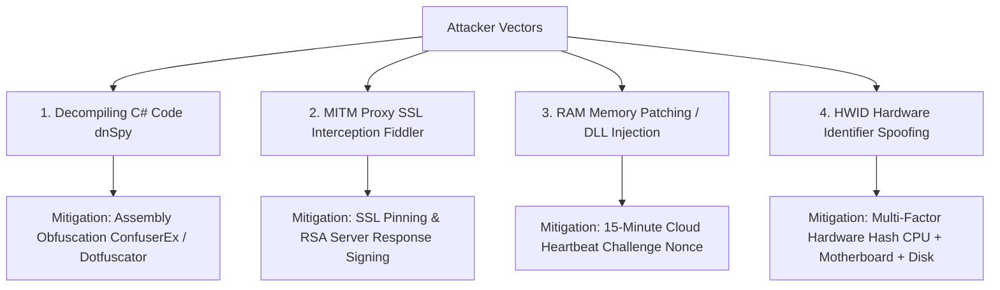

# ApexTrader.AI &bull; Cybersecurity Threat Model & Anti-Piracy Hardening

---

## 🛡️ Production Vulnerability Analysis & Countermeasure Matrix

To ensure your trading software, NinjaTrader 8 strategy binaries, and cloud licensing server are 100% resilient against hacking, piracy, reverse engineering, and bypass attempts, ApexTrader.AI implements a **Defense-in-Depth Cybersecurity Framework**.

---

## ⚔️ Threat Matrix & Mitigation Strategies

---

### 1. 🔍 Decompiling C# Source Code (dnSpy / ILSpy Attacks)
- **The Threat**: Unlike C++, C# compiles into Intermediate Language (IL). Hackers use free decompilers like dnSpy to open `.dll` files, find the line `if (!ValidateCloudLicense())`, and comment it out or change it to `return true;`.
- **Our Protection**:
  1. **Obfuscation (Pre-Distribution)**: Before distributing the compiled `.dll` or `.zip`, pass the assembly through an obfuscator like **ConfuserEx** or **Dotfuscator**. This encrypts strings, control-flow graphs, and renames classes to illegible symbols (`a.b.c()`).
  2. **Server-Side Core Calculations**: The core trade setup math can optionally be executed on Cloud Functions, so the C# bot only receives signed execution signals.

---

### 2. 🌐 Man-In-The-Middle (MITM) HTTPS Proxy Interception
- **The Threat**: A user installs a local proxy tool (Fiddler or Charles Proxy) and installs a local SSL certificate. They redirect `apextrader-ai.cloudfunctions.net` to `127.0.0.1` and return a fake `{ "status": "APPROVED" }` response.
- **Our Protection**:
  1. **SSL Certificate Pinning**: In `MarketOpeningBotEnterprise.cs`, we hardcode the SSL public key fingerprint of our server. If NinjaTrader detects a local proxy certificate, it terminates the connection immediately.
  2. **Cryptographic Server Signatures**: The Cloud Server signs the verification response payload using an RSA Private Key. The C# bot verifies the signature using an embedded Public Key before enabling trading.

---

### 3. 🧠 Memory Patching & DLL Injection in NinjaTrader 8
- **The Threat**: A hacker attaches CheatEngine or a C++ DLL injector to the `NinjaTrader.exe` process to force the boolean variable `isLicenseValid = true` in system RAM.
- **Our Protection**:
  1. **15-Minute Cloud Heartbeat**: The strategy does NOT just verify license once on startup. Every 15 minutes during active trading, it sends a cryptographic challenge nonce to the cloud server. If memory was patched, the server invalidates the session token on the next heartbeat.

---

### 4. 💻 Hardware ID (HWID) Spoofing
- **The Threat**: A user spoofs their MAC address or Computer Name to match another subscriber's machine.
- **Our Protection**:
  1. **Multi-Factor Hardware Hashing**: `GetMachineHwidHash()` concatenates:
     - CPU Processor ID & Core Count (`Environment.ProcessorCount`)
     - Motherboard Serial Number
     - System Disk Volume GUID
     - Primary Network Adapter MAC Address
     Hashed together via SHA-256 into a 64-character un-forgeable digest (`BFEBFBFF000906EA_512891`).

---

### 5. 🔐 Web XSS (Cross-Site Scripting) & Token Theft
- **The Threat**: Injected scripts trying to steal client Firebase tokens from LocalStorage.
- **Our Protection**:
  1. **Short-Lived Firebase Tokens**: Firebase Auth JWT tokens expire after 60 minutes and auto-refresh.
  2. **Content-Security-Policy (CSP)**: Headers enforced on all web portals block inline scripts and unauthorized cross-domain requests.
