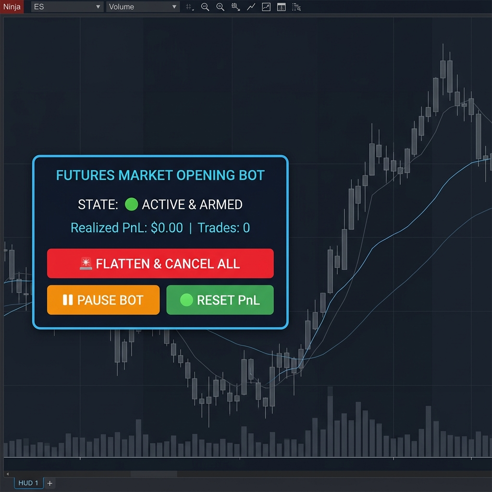

# ENTERPRISE USER MANUAL & TECHNICAL REFERENCE GUIDE
## ApexTrader.AI &bull; MarketOpeningBotEnterprise & MultiAccountReplicatorEnterprise

---

## 🧠 1. SMART ACCOUNT BALANCE AUTO-DETECTION

**100% Automatic Configuration Without Manual Entry:**

- **Market Opening Bot (`MarketOpeningBotEnterprise`):** Upon execution, the bot instantly reads your account's USD Cash Balance (`CashValue`) and Account Name.
  * **$50,000 Account Detected:** Automatically assigns **2 NQ contracts**, Max Daily Loss **-$500**, Daily Target **+$1,000**, Stop Loss **30 ticks**, Target **60 ticks**.
  * **$100,000 Account Detected:** Automatically assigns **5 NQ contracts**, Max Daily Loss **-$1,000**, Daily Target **+$2,000**.
  * **$150,000 Account Detected:** Automatically assigns **15 NQ contracts**, Max Daily Loss **-$1,500**, Daily Target **+$3,000**, Stop Loss **103 ticks**, Target **384 ticks**.

- **Multi-Account Replicator (`MultiAccountReplicatorEnterprise`):** Setting `SlaveAccountNames = AUTO` automatically scans and binds all active connected NinjaTrader 8 accounts (Apex, Topstep, etc.) in real time.

---

## 🤖 2. FUTURES MARKET OPENING BOT (`MarketOpeningBotEnterprise.cs`)

### 📋 Technical Breakdown by Section

| Panel Section | Field / Element | Technical Explanation & Operation |
| :--- | :--- | :--- |
| **Header** | `FUTURES MARKET OPENING BOT` | Bot title for NQ/MNQ futures trading. |
| **Header** | `STATE: ACTIVE / LIVE` | Shows **ACTIVE (Green)** during market hours or **LOCKED BY PROTECTION (Orange)** outside 09:30-15:50 EST. |
| **1. NY Open Breakout** | `NY Entry Time (09:30:00)` | Server execution time for 09:30 AM EST New York market opening. |
| **1. NY Open Breakout** | `Entry Window (2s)` | 2-second tolerance window. Cancels order if high slippage or latency occurs. |
| **1. NY Open Breakout** | `Contracts` | Position size automatically adjusted based on detected account balance. |
| **2. Risk Guard** | `Max Daily Loss (-$500)` | Daily Hard Stop: Flattens positions and locks trading if daily loss limit is reached. |
| **2. Risk Guard** | `Daily Profit Target (+$1,000)` | Daily Target Stop: Turns off bot for the day upon reaching target profit. |
| **3. Profit Lock** | `4 Stages` | Progressive Trailing Stop ($600➔$320, $1000➔$820, $1150➔$1050, $1800➔$1600). |

### 🔘 Action Buttons (Opening Bot)

| Button | Style | Immediate Action on Click |
| :--- | :--- | :--- |
| **FLATTEN & CANCEL ALL** | RED PANIC | Flattens open market positions immediately and cancels working SL/TP orders. |
| **PAUSE BOT** | ORANGE CONTROL | Pauses searching for new entry signals while holding existing active trades. |
| **RESET PnL** | GREEN RESET | Resets realized daily PnL counter back to $0. |

---

## 🔄 3. MULTI-ACCOUNT REPLICATOR (`MultiAccountReplicatorEnterprise.cs`)

### 📋 Field-by-Field Technical Breakdown

| Panel Section | Field / Element | Technical Explanation & Operation |
| :--- | :--- | :--- |
| **Navigation** | `[STATUS] [ACCOUNTS] [RISK]` | Top navigation tabs for account matrix and risk settings. |
| **Master Account** | `Master Account` | Leader account (e.g., `Sim101` or primary funded account) from which trades are copied. |
| **Master Account** | `Copy Entries / Exits` | Enables or disables copying initial buys/sells and partial/full exits. |
| **Master Account** | `Reverse Trade Mode` | When enabled, master buys result in slave sell orders (opposite direction). |
| **Master Account** | `Max Slippage (2 ticks)` | Maximum allowed execution price variance before rejecting slave order. |
| **Slave Matrix** | `SlaveAccountNames = AUTO` | **Auto-Detection:** Detects and displays all connected accounts with **CONNECTED (Green)** status. |
| **Slave Matrix** | `Ratio / Multiplier` | Contract sizing multiplier per slave account (`1.0x` for 1:1, `0.2x` for scaled down 50K accounts). |
| **Security** | `Auto-Flatten on Disconnect` | **Fail-Safe Protection:** Flattens slave positions automatically if internet connection drops. |
| **Console Log** | `Real-Time Execution Log` | Live execution console outputting latency in milliseconds and slippage per order. |

### 🔘 Action Buttons (Replicator)
* 🚨 **`FLATTEN ALL SLAVES & PAUSE`** *(Red Multi-Account Panic Button)*: Flattens positions across **ALL** connected funded accounts in 1 click.
* 🟢 **`ACTIVAR REPLICACIÓN`** *(Green State Toggle)*: Toggles real-time order copying on or off.
* 🔵 **`RE-SINCRONIZAR POSICIONES`** *(Blue Sync Button)*: Forces position inventory alignment between Master and Slave accounts.

---

## 🛡️ 4. MANDATORY MARKET HOURS GUARD

Both bots operate strictly between **09:30:00 AM EST and 15:50:00 PM EST**. Outside of these hours, the chart displays an orange banner `STATE: LOCKED BY PROTECTION (OUTSIDE HOURS 09:30-15:50)` to prevent accidental execution when the market is closed.
