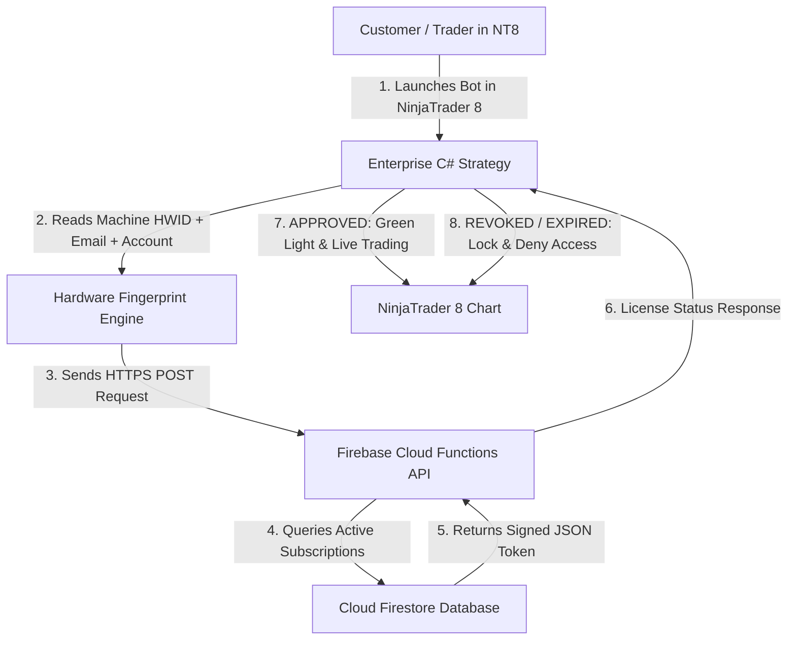

# ApexTrader.AI &bull; Cloud License Architecture & Firebase SaaS Specification

---

## 🔐 1. SaaS Cloud Verification Flow & Hardware Lock (HWID)



---

## 💻 2. Database Schema (Cloud Firestore)

### Collection: `users`
```json
{
  "uid": "usr_9981241A",
  "email": "trader@example.com",
  "name": "Alex Miller",
  "createdAt": "2026-08-16T12:00:00Z",
  "stripeCustomerId": "cus_N78214981"
}
```

### Collection: `licenses`
```json
{
  "licenseKey": "PRO-ENT-2026-KEY",
  "userId": "usr_9981241A",
  "planTier": "Prop Firm Pro ($199/mo)",
  "status": "ACTIVE", // ACTIVE | REVOKED | EXPIRED
  "maxAccounts": 10,
  "boundHwids": ["BFEBFBFF000906EA_512891"],
  "authorizedAccounts": ["PA_APEX_10482", "PA_APEX_10483", "TOPSTEP_50K_991"],
  "expiresAt": "2027-08-16T23:59:59Z"
}
```

---

## 🛠️ 3. Admin Management Panel Actions (Owner Dashboard)

- 🟢 **Approve License**: Instantly grants access upon subscription payment via Stripe webhook.
- 🔴 **Revoke / Block License**: Remote kill-switch revoking access if subscriber cancels or fails monthly payment.
- ➕ **Manage Authorized Accounts**: Allows adding or removing specific prop firm accounts (e.g. Apex 50K accounts).
- ⏱️ **Extend Expiration**: Manual or automated subscription extension.
