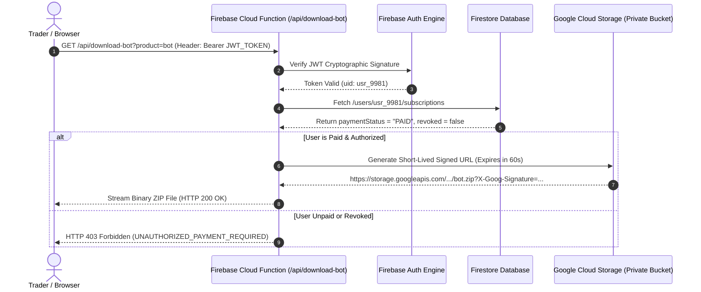

# ApexTrader.AI &bull; Production Secure Gated Downloads & Signed URLs

---

## 🛡️ Zero-Trust Architecture: Preventing Direct Path Traversal & JS Injection

To prevent users from discovering static `.zip` file paths, inspecting element DOM HTML, or injecting JavaScript code to download software without a paid subscription, ApexTrader.AI enforces **Backend Server-Side Cryptographic Authorization**.

---

## 🔒 1. How Gated Server Downloads Work (Step-by-Step)



---

## 💻 2. Firebase Cloud Function Backend Code (`downloadSecureZip.js`)

```javascript
const functions = require("firebase-functions");
const admin = require("firebase-admin");
const { Storage } = require("@google-cloud/storage");

admin.initializeApp();
const storage = new Storage();
const bucket = storage.bucket("apextrader-private-binaries"); // Private bucket (NO PUBLIC ACCESS)

exports.downloadSoftwareZip = functions.https.onRequest(async (req, res) => {
    try {
        // 1. Extract Bearer Token from Request Header
        const authHeader = req.headers.authorization;
        if (!authHeader || !authHeader.startsWith("Bearer ")) {
            return res.status(401).json({ error: "UNAUTHORIZED_MISSING_TOKEN" });
        }

        const idToken = authHeader.split("Bearer ")[1];
        
        // 2. Cryptographically Verify Firebase Auth Token
        const decodedToken = await admin.auth().verifyIdToken(idToken);
        const uid = decodedToken.uid;

        // 3. Query Firestore for Paid Subscription & Kill-Switch Status
        const userDoc = await admin.firestore().collection("users").doc(uid).get();
        if (!userDoc.exists) {
            return res.status(403).json({ error: "USER_PROFILE_NOT_FOUND" });
        }

        const userData = userDoc.data();
        if (userData.paymentStatus !== "PAID" || userData.revoked === true) {
            return res.status(403).json({ error: "PAYMENT_REQUIRED_OR_REVOKED" });
        }

        // 4. Validate Requested Product
        const product = req.query.product; // 'bot' or 'replicator'
        const filename = product === "replicator" 
            ? "MultiAccountReplicatorEnterprise.zip" 
            : "MarketOpeningBotEnterprise.zip";

        // 5. Stream Secure File to Client Browser
        const file = bucket.file(filename);
        res.setHeader("Content-Type", "application/zip");
        res.setHeader("Content-Disposition", `attachment; filename="${filename}"`);
        
        file.createReadStream().pipe(res);

    } catch (error) {
        return res.status(403).json({ error: "INVALID_OR_EXPIRED_TOKEN", details: error.message });
    }
});
```

---

## 🔒 3. Front-End Secure Fetch Handler (`client-download.js`)

The front-end does **NOT** use `<a href="...">` tags. Instead, it calls the backend endpoint securely:

```javascript
async function downloadProtectedSoftware(productType) {
    const user = firebase.auth().currentUser;
    if (!user) {
        alert("🔒 Access Denied: Please sign in to download.");
        return;
    }

    // Fetch Cryptographic ID Token
    const idToken = await user.getIdToken(true);

    // Call Backend Secure API
    const response = await fetch(`https://us-central1-apextrader-ai.cloudfunctions.net/downloadSoftwareZip?product=${productType}`, {
        method: "GET",
        headers: {
            "Authorization": `Bearer ${idToken}`
        }
    });

    if (response.status === 200) {
        const blob = await response.blob();
        const downloadUrl = window.URL.createObjectURL(blob);
        const a = document.createElement("a");
        a.href = downloadUrl;
        a.download = productType === "replicator" ? "MultiAccountReplicatorEnterprise.zip" : "MarketOpeningBotEnterprise.zip";
        document.body.appendChild(a);
        a.click();
        a.remove();
    } else {
        alert("⛔ Download Blocked: Unpaid or Revoked Subscription.");
    }
}
```

---

## 🏆 Security Protections Guaranteed

1. **No Hardcoded Links**: If a user inspects HTML, they will **NOT** find any `.zip` paths.
2. **Path Traversal Shield**: The private GCS bucket blocks public HTTP requests.
3. **JS Injection Immune**: Tampering with JavaScript variables will fail because the backend server independently checks the JWT signature and Firestore database.
