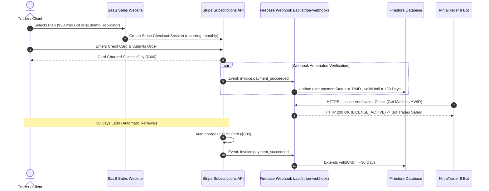

# ApexTrader.AI &bull; Stripe Subscription Billing & Webhook Architecture

---

## 💳 How Auto-Renew & Payment Collection Works (Step-by-Step)

To enable **automatic monthly auto-renewals** and receive payments directly into your bank account, ApexTrader.AI integrates with **Stripe Billing / Subscriptions API**.

---

## 🔄 1. Recurring Payment Lifecycle & Automated Payouts



---

## 🏦 2. How You Receive Your Money (Bank Payouts)

1. **Direct Deposit to Your Bank**:
   - Money collected via Stripe is deposited automatically into your business checking account on a **2-day rolling payout schedule** (or daily payouts).
2. **Supported Payment Methods**:
   - Credit / Debit Cards (Visa, MasterCard, Amex).
   - Apple Pay / Google Pay 1-Click Payment.

---

## 🔒 3. Handling Cancelations & Failed Auto-Renewals (Auto Kill-Switch)

When a customer's monthly payment fails (insufficient funds, expired card) or they cancel their subscription:

1. **Stripe sends event `invoice.payment_failed`**:
   - Stripe retries the card 3 times over 7 days (Smart Retries).
2. **Server Updates Firestore**:
   - If payment is not recovered, the server sets `paymentStatus = "UNPAID"` or `revoked = true`.
3. **NinjaTrader 8 Auto-Shutdown**:
   - Next time NinjaTrader 8 checks license status on startup, the cloud server returns `HTTP 403 Forbidden`.
   - The C# strategy outputs: `❌ LICENSE EXPIRED OR UNPAID. Disabling Bot.` and disables trading execution.

---

## 💻 4. Stripe Webhook Server Endpoint (`stripeWebhook.js`)

```javascript
const functions = require("firebase-functions");
const admin = require("firebase-admin");
const stripe = require("stripe")("sk_test_SAMPLE_SECRET_KEY");

const endpointSecret = "whsec_SAMPLE_WEBHOOK_SECRET";

exports.handleStripeWebhook = functions.https.onRequest(async (req, res) => {
    const sig = req.headers["stripe-signature"];
    let event;

    try {
        event = stripe.webhooks.constructEvent(req.rawBody, sig, endpointSecret);
    } catch (err) {
        return res.status(400).send(`Webhook Error: ${err.message}`);
    }

    // Handle Subscription Events
    switch (event.type) {
        case "invoice.payment_succeeded":
            const invoice = event.data.object;
            const customerEmail = invoice.customer_email;
            
            // Extend user license by 30 days in Firestore
            await admin.firestore().collection("users").doc(customerEmail).set({
                paymentStatus: "PAID",
                validUntil: new Date(Date.now() + 30 * 24 * 60 * 60 * 1000),
                revoked: false
            }, { merge: true });
            break;

        case "invoice.payment_failed":
        case "customer.subscription.deleted":
            const failedInvoice = event.data.object;
            const userEmail = failedInvoice.customer_email;

            // Revoke license access in Firestore (Kill-Switch Active)
            await admin.firestore().collection("users").doc(userEmail).set({
                paymentStatus: "UNPAID",
                revoked: true
            }, { merge: true });
            break;
    }

    res.json({ received: true });
});
```
